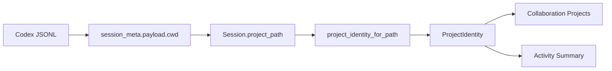
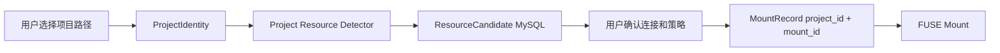

# 统一项目身份设计稿

## 1. 背景

当前 Traceway 已经在协作功能中引入了 `ProjectIdentity`，用于把 Codex session 归属到某个项目。现有实现主要从 Codex session JSONL 的 `session_meta.payload.cwd` 提取 `project_path`，再根据该路径向上查找 Git root、读取 Git remote 和 branch，生成项目标识。

后续 Project Context Mounts 会继续以“项目”为中心，为每个项目挂载 MySQL、Postgres、Redis、S3、日志等外部上下文资源。如果挂载功能重新实现一套项目识别逻辑，就会出现同一个目录在不同功能里被识别成不同项目的问题。

因此需要把项目身份设计成一个统一底座：

```text
任何功能只要需要表达“这是哪个项目”，都必须使用同一个 ProjectIdentity。
```

## 2. 目标

1. 为 session 管理、LAN 协作、Project Context Mounts、活动总结等功能提供统一项目身份。
2. 明确 `projectId` 的生成规则，避免同一个项目在不同模块里分裂。
3. 把“项目身份识别”和“项目资源发现”分开。
4. 支持同一 Git remote 的不同本地 checkout 被识别为同一项目。
5. 支持无 Git 项目的 fallback。
6. 为后续跨机器协作、挂载注册表、项目级配置提供稳定 key。

## 3. 非目标范围

1. 不在此文档中设计数据库连接发现细节；那属于 Project Resource Detector。
2. 不设计云端项目账号体系。
3. 不要求所有机器上的本地路径一致。
4. 不把 `gitBranch` 纳入 `projectId`，因为同一项目的不同分支仍应是同一个项目。
5. 不在 MVP 中做复杂 monorepo package identity；先以 Git repo root 作为项目边界。

## 4. 核心原则

### 4.1 项目身份是公共底座

所有模块应复用同一个项目身份生成函数：

```rust
project_identity_for_path(path: Option<&str>) -> ProjectIdentity
```

不允许各模块自行用 path、remote、workspace 名称重新 hash 出项目 ID。

### 4.2 项目身份和资源发现分离

项目身份回答：

```text
这个路径属于哪个项目？
```

资源发现回答：

```text
这个项目连接了哪些外部资源？
```

两者应拆成不同模块：

```text
backend/src/project.rs              # ProjectIdentity
backend/src/project_resources.rs    # ResourceCandidate detection
```

### 4.3 Remote 优先，Path fallback

如果项目有 Git remote，则使用规范化后的 Git remote hash 作为跨机器稳定身份。

如果项目没有 Git remote，则使用本地规范化路径 hash 作为 fallback。

## 5. 当前实现概览

当前项目身份逻辑散落在：

| 位置 | 职责 |
| --- | --- |
| `backend/src/scanner.rs` | 从 Codex JSONL 读取 `session_meta.payload.cwd`，保存为 `Session.project_path` |
| `backend/src/collaboration.rs` | `project_identity_for_path` 根据 `project_path` 生成 `ProjectIdentity` |
| `backend/src/api.rs` | `collaboration_projects` 遍历 sessions 并按 `project_id` 去重 |
| `backend/src/models.rs` | 定义 `ProjectIdentity` 数据结构 |

现有流程：

```text
Codex session JSONL
  -> session_meta.payload.cwd
  -> Session.project_path
  -> project_identity_for_path(project_path)
  -> ProjectIdentity
```

## 6. ProjectIdentity 数据模型

当前结构可以继续使用：

```rust
pub struct ProjectIdentity {
    pub project_id: String,
    pub root_path: Option<String>,
    pub path_label: String,
    pub git_remote_hash: Option<String>,
    pub git_branch: Option<String>,
}
```

字段含义：

| 字段 | 类型 | 说明 |
| --- | --- | --- |
| projectId | string | 项目稳定 ID。优先来自 Git remote hash，否则来自本地 path hash |
| rootPath | string/null | 本机可访问的项目根目录。Git 项目用 repo root，无 Git 项目用传入路径 |
| pathLabel | string | UI 展示名，通常是 `rootPath` 最后一级目录 |
| gitRemoteHash | string/null | 规范化 remote URL 的短 hash |
| gitBranch | string/null | 当前 branch 或 detached commit 前缀 |

后续可扩展字段：

| 字段 | 类型 | 说明 |
| --- | --- | --- |
| identityKind | gitRemote/path/unknown | 标识来源 |
| normalizedRemoteHost | string/null | 脱敏后的 host，例如 `github.com` |
| repoSlugHash | string/null | repo path hash |
| detectedAt | ISO string | 识别时间 |

MVP 不必立即加这些字段，避免扩大迁移范围。

## 7. projectId 生成规则

### 7.1 Git remote 项目

如果能找到 Git root，并读取到 origin remote：

```text
normalized_remote = normalize_git_remote_url(origin.url)
git_remote_hash = short_hash(normalized_remote)
project_id = "project_git_" + git_remote_hash
```

示例：

```text
git@github.com:Example/Repo.git
https://github.com/example/repo.git
```

都应规范化为：

```text
github.com/example/repo
```

然后生成同一个 `projectId`。

### 7.2 无 Git remote 项目

如果没有 Git root 或没有 origin remote：

```text
normalized_path = normalize_local_path(project_path)
project_id = "project_" + short_hash(normalized_path)
```

### 7.3 Unknown 项目

如果没有任何路径：

```text
project_id = "project_unknown"
path_label = "unknown-project"
root_path = null
```

Unknown 项目只应用于 UI 聚合和兜底，不建议用于创建 Project Context Mounts。

## 8. 路径和 Git 识别规则

### 8.1 Git root

从输入 path 向上查找 `.git`：

1. 如果 path 是文件，从 parent 开始。
2. 如果 path 是目录，从自身开始。
3. 向上直到根目录。
4. 找到 `.git` 文件或目录即认为是 Git root。

### 8.2 Worktree 支持

如果 `.git` 是文件，内容可能是：

```text
gitdir: ../.git/worktrees/foo
```

需要解析 gitdir，并读取 `commondir` 找到真正的 common git dir，再读取 common config 中的 remote。

### 8.3 Branch

读取 `.git/HEAD`：

```text
ref: refs/heads/main -> main
<commit-sha> -> commit 前 12 位
```

branch 不参与 `projectId`，只作为展示和协作上下文。

### 8.4 Remote URL 规范化

规则：

1. trim 空白。
2. 去掉末尾 `/`。
3. 去掉末尾 `.git`。
4. 支持 SSH remote：

```text
git@github.com:Example/Repo.git -> github.com/example/repo
```

5. 支持 HTTPS remote：

```text
https://user@github.com/Example/Repo.git -> github.com/example/repo
```

6. 全部转小写。

## 9. 模块边界

### 9.1 Project Identity 模块

建议新增：

```text
backend/src/project.rs
```

职责：

1. 根据 path 生成 `ProjectIdentity`。
2. 查找 Git root。
3. 解析 `.git` 文件和 worktree common dir。
4. 读取 origin remote。
5. 读取 branch。
6. 规范化 remote URL。
7. 生成 path label。

公开函数：

```rust
pub fn project_identity_for_path(path: Option<&str>) -> ProjectIdentity;
pub fn project_identity_for_root(root: &Path) -> ProjectIdentity;
pub fn normalize_git_remote_url(remote: &str) -> String;
pub fn find_git_root(path: &Path) -> Option<PathBuf>;
```

其中部分函数可以先 `pub(crate)`，只对后端内部开放。

### 9.2 Session Scanner

`scanner.rs` 继续只负责从 Codex session 中提取 `project_path`：

```text
session_meta.payload.cwd -> Session.project_path
```

它不负责计算 `ProjectIdentity`。

### 9.3 Collaboration

`collaboration.rs` 不再拥有项目身份生成逻辑，而是调用：

```rust
crate::project::project_identity_for_path(...)
```

协作分享策略继续以 `projectId` 为 key。

### 9.4 Project Resource Detector

后续新增：

```text
backend/src/project_resources.rs
```

输入必须是 `ProjectIdentity`，特别是 `rootPath`：

```rust
pub fn detect_project_resources(project: &ProjectIdentity) -> Vec<ResourceCandidate>;
```

它不能重新计算 `projectId`。

### 9.5 Project Context Mounts

Mount Registry 必须使用同一个 `projectId`：

```text
mount_key = project_id + mount_id
```

不允许使用 mountpoint path 自己生成另一套项目 ID。

## 10. 数据流

### 10.1 Session 归属数据流



### 10.2 Context Mount 数据流



## 11. API 影响

现有 API 中 `GET /api/collaboration` 返回：

```json
{
  "projects": [
    {
      "projectId": "project_git_xxx",
      "rootPath": "/repo/app",
      "pathLabel": "app",
      "gitRemoteHash": "xxx",
      "gitBranch": "main"
    }
  ]
}
```

Project Context Mounts 可以复用同一个 project object。

建议后续新增项目级 API：

```http
GET /api/projects
GET /api/projects/{projectId}
POST /api/projects/resolve
```

### 11.1 Resolve Project

用于用户手动选择一个目录后解析项目身份：

```http
POST /api/projects/resolve
```

请求：

```json
{
  "path": "/repo/app"
}
```

响应：

```json
{
  "project": {
    "projectId": "project_git_xxx",
    "rootPath": "/repo/app",
    "pathLabel": "app",
    "gitRemoteHash": "xxx",
    "gitBranch": "main"
  }
}
```

## 12. 与 Project Context Mounts 的关系

Project Context Mounts 不需要重新判断“这是不是同一个项目”。它只做：

1. 输入 `ProjectIdentity`。
2. 使用 `project.rootPath` 扫描 `.env`、`docker-compose.yml`、ORM 配置。
3. 生成 `ResourceCandidate`。
4. 用户确认后创建 `MountRecord`。

示例：

```json
{
  "projectId": "project_git_abc",
  "mountId": "mysql-main",
  "mountPoint": "/repo/app/.traceway/mounts/mysql-main",
  "credentialProfileId": "profile_123",
  "policyId": "policy_123"
}
```

## 13. Monorepo 处理

MVP 以 Git root 作为项目边界：

```text
/repo
  /packages/api
  /packages/web
```

如果 `packages/api` 和 `packages/web` 属于同一个 Git repo，它们会共享同一个 `projectId`。

这对协作和挂载有利有弊：

- 好处：同一 repo 内跨包协作能聚合到一个项目。
- 风险：不同 package 连接不同数据库时，需要用不同 `mountId` 区分。

示例：

```text
project_git_abc + mysql-api
project_git_abc + mysql-web
```

后续如果 monorepo 需要 package 级身份，可以在 ProjectIdentity 之上新增 `ProjectScope`：

```text
project_id = repo identity
scope_id = package path hash
```

MVP 不建议直接引入，避免复杂度过高。

## 14. 迁移计划

### 14.0 立即执行范围

当前立刻要做 **Phase 1 和 Phase 2**。

执行顺序必须是：

1. 先完成后端 Phase 1：抽出统一项目身份模块，保证现有行为不变。
2. 再完成后端 Phase 2：新增项目 API，让后续前端和 Project Context Mounts 都能复用同一套项目身份。
3. 后端改完并通过验证后，再明确前端如何改；不要在后端项目身份尚未稳定前先重构前端。
4. Phase 3 资源发现先不实现，只保留设计接口，避免把项目身份重构和数据库发现混在同一个变更里。

本阶段的目标不是做 MySQL 挂载，而是先把“项目身份”统一成后续所有功能都能依赖的稳定底座。

### Phase 1：抽模块，不改行为

1. 新增 `backend/src/project.rs`。
2. 从 `collaboration.rs` 移动以下逻辑：
   - `project_identity_for_path`
   - `find_git_root`
   - `git_dir_for_root`
   - `git_common_dir`
   - `read_origin_remote`
   - `read_git_branch`
   - `normalize_git_remote_url`
3. `collaboration.rs` 改为调用 `crate::project`。
4. 保持 API response 和 `ProjectIdentity` 结构不变。
5. 迁移现有测试。
6. 运行后端测试，确认项目身份相关行为没有变化。

### Phase 2：项目 API

1. 新增 `GET /api/projects`。
2. 新增 `POST /api/projects/resolve`。
3. `GET /api/projects` 返回当前本机已知项目列表，数据来源可以先复用当前 sessions 聚合逻辑。
4. `POST /api/projects/resolve` 接收本地路径，返回统一 `ProjectIdentity`。
5. 保持 `GET /api/collaboration` 的 `projects` 字段兼容，不要破坏现有前端。
6. 为新增 API 添加后端测试。
7. 后端完成后，再单独输出前端改造说明。

### Phase 3：资源发现

1. 新增 `project_resources.rs`。
2. 输入 `ProjectIdentity`。
3. 输出 `ResourceCandidate[]`。
4. Project Context Mounts 使用 `projectId` 创建 mount。

Phase 3 不是当前立即执行范围。它依赖 Phase 1 和 Phase 2 的统一项目身份稳定后再开始。

## 15. 后端完成后的前端改造说明

后端 Phase 1 和 Phase 2 完成后，再改前端。前端改造目标是把“项目列表”和“项目解析”从协作功能中解耦出来，供协作面板和未来 Project Context Mounts 共用。

建议前端改造顺序：

1. 在 `frontend/src/api.ts` 新增：

```ts
export function fetchProjects()
export function resolveProject(path: string)
```

2. 在 `frontend/src/types.ts` 复用或扩展现有 `ProjectIdentity` 类型，不新增另一套项目类型。

3. 在 `frontend/src/App.tsx` 增加独立项目状态：

```ts
const [projects, setProjects] = useState<ProjectIdentity[]>([]);
```

4. 协作功能仍可暂时读取 `fetchCollaborationState().projects`，但新项目 API 可先用于未来挂载页面和调试入口。

5. 后续新增 Project Context Mounts 页面时，必须从统一 `projects` 状态选择项目，而不是根据路径重新生成项目 ID。

6. 前端不要自己 hash path、remote 或 mountpoint。任何需要项目身份的地方都调用后端 `resolveProject` 或使用后端返回的 `ProjectIdentity`。

前端改造完成后的状态边界应是：

```text
Backend ProjectIdentity API
  -> frontend ProjectIdentity state
  -> CollaborationPanel
  -> Future Project Context Mounts Panel
```

## 16. 可直接使用的实现提示词

下面提示词用于让 Codex 直接实现当前立即范围，也就是后端 Phase 1 和 Phase 2。建议在新线程或新任务中使用。

```text
请在当前 Traceway / codex-session-manager 仓库中实现 docs/unified-project-identity-design.md 里的 Phase 1 和 Phase 2。

执行范围：
1. 只做统一项目身份后端重构和项目 API。
2. 不实现 Project Resource Detector。
3. 不实现 MySQL/FUSE/Project Context Mounts。
4. 不重构前端；后端完成并验证后，再总结前端应该怎么改。

Phase 1 要求：
1. 新增 backend/src/project.rs。
2. 将 backend/src/collaboration.rs 中的项目身份逻辑迁移到 project.rs，包括：
   - project_identity_for_path
   - find_git_root
   - git_dir_for_root
   - git_common_dir
   - read_origin_remote
   - read_git_branch
   - normalize_git_remote_url
3. collaboration.rs 改为调用 crate::project::project_identity_for_path。
4. 保持 ProjectIdentity 结构和现有 API response 不变。
5. 迁移或保留现有测试，保证行为不变。

Phase 2 要求：
1. 新增 GET /api/projects，返回当前本机已知项目列表，数据来源先复用现有 sessions 聚合逻辑。
2. 新增 POST /api/projects/resolve，请求 body 为 { "path": "/some/project/path" }，返回 { "project": ProjectIdentity }。
3. 保持 GET /api/collaboration 的 projects 字段兼容，不破坏当前前端。
4. 为新增 API 和 project 模块补充后端测试。

验证要求：
1. 运行 cargo fmt --check。
2. 运行 cargo test。
3. 如果测试或格式化失败，请修复后再结束。

输出要求：
1. 总结改了哪些文件。
2. 说明后端新增 API 的请求/响应格式。
3. 明确下一步前端应该怎么改，但不要直接改前端。
```

## 17. 测试策略

### 17.1 Git remote 归一化

覆盖：

```text
git@github.com:Example/Repo.git
https://github.com/example/repo.git
https://user@github.com/example/repo
```

应得到相同 normalized remote。

### 17.2 不同 checkout 同一 remote

两个不同本地路径，只要 origin remote 一致，应得到相同 `projectId`。

### 17.3 不同 branch

同一 repo 不同 branch，应得到相同 `projectId`，但 `gitBranch` 不同。

### 17.4 无 Git 项目

无 Git 项目应 fallback 到 path hash。

### 17.5 Worktree

`.git` 是文件且包含 `gitdir:` 时，应正确读取 common dir 中的 remote，并读取当前 worktree 的 HEAD。

### 17.6 Unknown

空路径或缺失路径应返回 `project_unknown`。

## 18. 风险与待确认问题

1. 同一 remote 的 fork 是否应该被视为同一项目？当前规则会根据 remote 区分 fork。
2. 同一 repo 的不同 package 是否需要 package 级 identity？MVP 暂不支持。
3. 本地无 Git 项目如果移动目录，path fallback 的 `projectId` 会变化。
4. remote hash 虽然脱敏，但仍可能被暴力枚举常见仓库，需要评估是否足够。
5. 如果用户修改 origin remote，`projectId` 会变化，需要后续迁移策略。
6. 如果 session 中的 `cwd` 是 repo 子目录，当前 rootPath 会归一到 Git root，这是期望行为，但 UI 可能需要展示原始 session path。

## 19. 验收标准

1. 协作功能和 Project Context Mounts 使用同一个 `ProjectIdentity` 生成逻辑。
2. 同一 Git remote 的不同本地 checkout 生成同一个 `projectId`。
3. 同一项目不同 branch 不改变 `projectId`。
4. 无 Git 项目能稳定 fallback 到 path hash。
5. `projectId` 不由 Project Resource Detector 或 Mount Registry 重新生成。
6. 现有 `/api/collaboration` 的 `projects` response 行为不变。
7. 现有 collaboration 相关测试迁移后继续通过。
